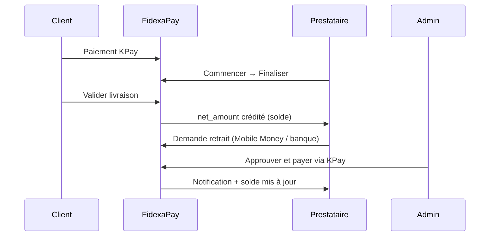

# Retraits FidexaPay — Politique, test & prod

## Comment fonctionne le solde

```
Solde disponible = Gains validés (net_amount) − Retraits payés − Retraits en cours
```

- **Gains validés** : commandes où le client a validé la livraison (`order_status = validated`, `escrow_released = true`). C’est le `net_amount` après commission FidexaPay.
- **Non retirable** : fonds encore en escrow, commandes en cours, litiges.

---

## Politique de retrait

| Règle | Valeur |
|-------|--------|
| KYC | Obligatoire (`verified`) |
| Délai | 24–48 h ouvrées |
| Demandes simultanées | 1 max (pending ou processing) |
| Frais retrait | 0 % (lancement) |

### Seuils minimum par devise

| Devise | Minimum | Maximum / demande |
|--------|---------|-------------------|
| CDF | 10 000 | 1 000 000 000 |
| XOF / FCFA | 500 | ~3 280 000 |
| XAF | 500 | ~3 280 000 |
| USD | 10 | 8 000 |

---

## Flux complet



### Côté prestataire (`/dashboard/withdrawal`)

1. Voir **solde disponible**
2. Choisir Mobile Money ou virement
3. Soumettre la demande
4. Suivre le statut : En attente → En cours → Payé

### Côté admin (`/admin/withdrawals`)

**Payout automatique KPay** (Mobile Money) :

1. **Approuver et payer** → withdraw KPay vers le numéro indiqué
2. Webhook `payout.completed` → statut **Payé** automatiquement
3. **Marquer payé** — fallback si payout reste en pending

**Flux manuel** (virement bancaire) :

1. **Approuver (manuel)** → statut En cours
2. Payer hors plateforme
3. **Marquer payé**
4. **Refuser** : avec motif (KYC, fraude, solde, etc.)

---

## Comment tester en sandbox

### Prérequis

1. Au moins **une commande payée + validée** (escrow libéré avec `net_amount`)
2. Prestataire avec **KYC vérifié** (admin → `/admin/kyc` → Approuver)
3. Migration `20260729_withdrawal_workflow.sql` appliquée

### Scénario test prestataire

1. Connectez-vous en prestataire
2. Allez sur **Retraits** — vérifiez le solde disponible > 0
3. Demandez un montant ≤ solde et ≥ minimum (ex. 10 000 CDF)
4. Mobile Money : Orange / MTN + numéro +243…
5. Confirmez → statut **En attente**

### Scénario test admin

1. Connectez-vous en admin → **Retraits**
2. Ouvrez la demande → **Approuver (en cours)**
3. Simulez le paiement externe → **Marquer payé**
4. Côté prestataire : statut **Payé**, solde diminué

### Test refus

1. Nouvelle demande → Admin → **Refuser** + motif
2. Prestataire voit le motif et peut refaire une demande

---

## Mise en production (retraits)

- [ ] Domaine prod + HTTPS
- [ ] KPay **Live** (clés `kpay_live_` / `sk_live_` après KYC)
- [ ] Wallet KPay approvisionné pour les payouts
- [ ] Process ops documenté (qui approuve, horaires)
- [ ] Webhook KPay pointant vers `kpay-webhook`

---

## RPC Supabase

| RPC | Rôle |
|-----|------|
| `get_provider_wallet` | Solde disponible |
| `request_withdrawal` | Créer une demande |
| `cancel_my_withdrawal` | Annuler (pending) |
| `admin_process_withdrawal` | Approuver / payer / refuser |
